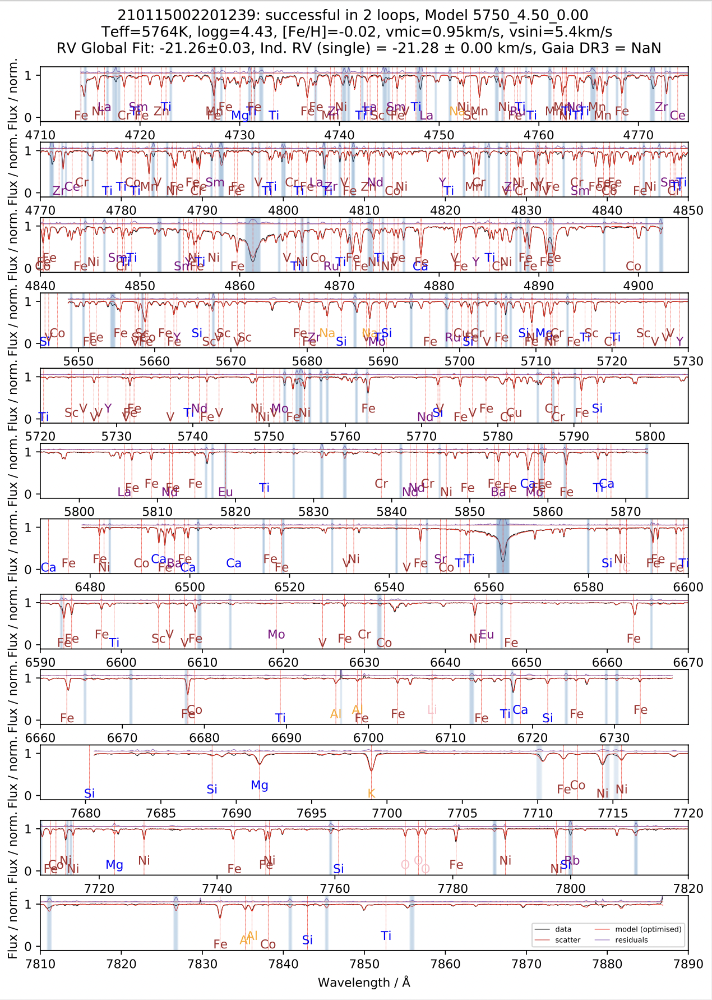
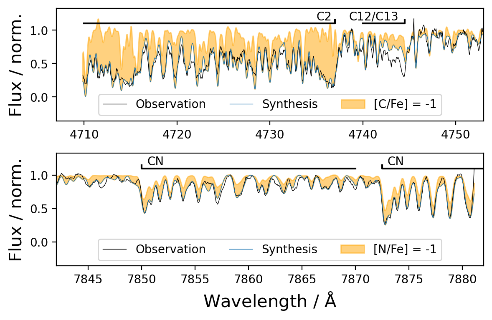

# GALAH_DR4 - Data Analysis Repository

This data analysis repository accompanies the Data Release 4 (DR4) of the Galactic Archaeology with HERMES (GALAH) Survey.

GALAH is a stellar spectroscopic survey of a million stars in the Milky Way. It's scientific motivation is described by [De Silva et al. (2015)](http://adsabs.harvard.edu/abs/2015MNRAS.449.2604D). GALAH had three previous data releases: DR1 [(Martell et al. 2017)](https://ui.adsabs.harvard.edu/abs/2017MNRAS.465.3203M), DR2 [Buder et al. 2018)](https://ui.adsabs.harvard.edu/abs/2018MNRAS.478.4513B), and DR3 [(Buder et al. 2021)](https://ui.adsabs.harvard.edu/abs/2021MNRAS.506..150B). For more information see [the GALAH survey website](https://www.galah-survey.org).

## Quick Links

**Data Release Paper:** https://ui.adsabs.harvard.edu/abs/2024arXiv241012345B or https://arxiv.org/abs/2410.12345/  
**Catalogue Access:** https://cloud.datacentral.org.au/teamdata/GALAH/public/GALAH_DR4/  (including main catalogues for all spectra and all stars as well as value-added-catalogues)  
**Interactive Visualisation:** https://docs.datacentral.org.au/galah/  

GALAH operates with unique *sobject_id* as identifier of spectra for dates (first 6 digits), runs (next 4 digits), and repeats (next 2 digits), fibres (next 3 digits), and CCDs (last digit).

We also include matches to both *Gaia* DR3 (as *gaiadr3_source_id*) and 2MASS (as *tmass_id*) for all sources.

## Which Flags to Use?

- **flag_sp**: We recommend to use lower values (with 0 meaning no significant issue found).
- **flag_fe_h**: We recommend to neglect this flag
- **flag_x_fe**: Use *flag_x_fe* == 0 for all considered elements of the science case

## Abstract

The stars of the Milky Way carry the chemical history of our Galaxy in their atmospheres as they journey through its vast expanse. Like barcodes, we can extract the chemical fingerprints of stars from high-resolution spectroscopy. The fourth data release (DR4) of the Galactic Archaeology with HERMES (GALAH) Survey, based on a decade of observations, provides the chemical abundances of up to 32 elements for 917,588 stars that also have exquisite astrometric data from the $Gaia$ satellite. For the first time, these elements include life-essential nitrogen to complement carbon, and oxygen as well as more measurements of rare-earth elements critical to modern-life electronics, offering unparalleled insights into the chemical composition of the Milky Way.

For this release, we use neural networks to simultaneously fit stellar parameters and abundances across the full spectrum, leveraging synthetic grids computed with Spectroscopy Made Easy. These grids account for atomic line formation in non-local thermodynamic equilibrium for 14 elements. In a two-iteration process, we first fit stellar labels for all 1,085,520 spectra, then co-add repeated observations and refine these labels using astrometric data from $Gaia$ and 2MASS photometry, improving the accuracy and precision of stellar parameters and abundances. Our validation thoroughly assesses the reliability of spectroscopic measurements and highlights key caveats for catalogue users.

GALAH DR4 represents yet another milestone in Galactic archaeology, combining detailed chemical compositions from multiple nucleosynthetic channels with kinematic information and age estimates. The resulting dataset, covering nearly a million stars, opens new avenues for understanding not only the chemical and dynamical history of the Milky Way, but also the broader questions of the origin of elements and the evolution of planets, stars, and galaxies.

## Contents of this repository

In this repository, you find the relevant code and example spectra (excluding large files) for reproducing the GALAH data analysis.
Input files are provided by the reduction pipeline of GALAH, which is also published on a [github repository](https://github.com/sheliak/galah_reduction).


This repository contains the analysis code, products, and necessary scripts to reproduce the GALAH DR4 analysis pipeline. Below is a brief description of the directory structure:

```bash
├── analysis_products_allstar/       # Analysis results for all observed stars, grouped by observation date and star IDs
│   └── 210115/                      # Reference (first) observation date
│       └── 210115002201239/         # Star-specific analysis products (one for each star based on co-added repeat observations)
├── analysis_products_single/        # Analysis results for individual observations
│   └── 210115/                      # Specific observation date
│       └── 210115002201239/         # Spectrum-specific analysis products (one for each visit of a star)
├── auxiliary_information/           # Cross-matches with other catalogs (e.g., Gaia, 2MASS) and additional literature
├── catalogs/                        # Final catalog products for publication
├── observations/                    # Reduced spectra from the observation pipeline, organized by observation date and star ID
│   └── 210115/                      # Observation date
│       └── spectra/                 # 
│           └── com/                 # 
│               └── 210115002201239* # Reduced spectra FITS files with * being a placeholder for CCDs (e.g. *1.fits)
├── spectrum_analysis/               # Code and tools for analyzing spectra to derive stellar parameters and chemical abundances
├── spectrum_grids/                  # Scripts and models for synthetic spectral grids using Spectroscopy Made Easy
├── spectrum_interpolation/          # Tools for interpolating synthetic spectra using trained neural networks
├── spectrum_post_processing/        # Code for post-processing analyzed spectra, including final adjustments and corrections
├── tutorials/                       # Tutorials for plotting reduced spectra - more tutorials are available at [DataCentral](https://docs.datacentral.org.au/galah/)
├── validation/                      # Scripts and figures for validating the analysis against benchmark stars and other surveys like APOGEE
```

## Overview of GALAH DR4

### What's new? Fastly interpolated synthetic spectra for the whole wavelength range

To allow the simultanious fitting of stellar parameters and abundances (a shortcoming of the previous data releases affecting especially blended regions), we have changed our fitting approach. We are now producing synthetic spectra for a limited random selection and train neural networks on them. This allows to fit all 5 stellar parameters (Teff, logg, [Fe/H], vmic, vsini) and up to 31 elemental abundances at the same time.

<p align=center>
    
</p>

### What's new? CNO Abundances

We are fitting CNO abundances now! Thanks to the enhanced creation of synthetic stellar spectra, we are now also producing synthetic spectra for regions with strong molecular absorption features, like C2 (C12-C12 Swan bands before 4738Å) and CN (beyond 7870Å) as well as an underlying CN feature throughout most of the red and infrared region (most notably in cool giants).
<p align=center>
    
</p>

## Flag bitmask explanation

### flag_sp bitmask:

*Bitmask* | *Description* | 
:--------------|:--------------|
0 | No flag rasied | 
1 | Emission in Halpha/Hbeta detected | 
2 | Broadening (vsini) warning | 
4 | Microturbulence (vmic) warning | 
8 | chi square unusually low/high by 3 sigma | 
16 | Double line splitting detected (SB2) | 
32 | Not all 4 CCDs available | 
64 | Extrapolating spectrum model | 
128 | No spectroscopic analysis results available | 

### flag_x_fe bitmask:

*Bitmask* | *Description* | 
:--------------|:--------------|
0 | No flag rasied | 
1 | Upper limit | 
2 | No measurement available | 

## Data model of galah_dr4_allspec file

*Column Name* | *Units* | *Description* | *Data Type* | 
:--------------|:--------------|:------------|:----------|
sobject_id |  | GALAH identifier | >i8 | 
tmass_id |  | 2MASS identifier | <U16 | 
gaiadr3_source_id |  | Gaia DR3 source_id | >i8 | 
ra | deg | propagated from Gaia DR3 | >f8 | 
dec | deg | propagated from Gaia DR3 | >f8 | 
flag_sp |  | Major spectroscopic fitting quality bitmask flag | >i8 | 
chi2_sp |  | Chi2 value of spectroscopic fitting | >f4 | 
model_name |  | Neural network model used for creating synthetic spectra | <U16 | 
teff | K | Spectroscopic effective temperature (used for fitting) | >f4 | 
e_teff | K | Uncertainty teff | >f4 | 
logg | log(cm.s**-2) | Spectroscopic surface gravity (used for fitting) | >f4 | 
e_logg | log(cm.s**-2) | Uncertainty logg | >f4 | 
fe_h | dex | Abundance of Fe and all other elements not fitted in GALAH (Fe: 1D-NLTE) | >f4 | 
e_fe_h | dex | Uncertainty fe_h | >f4 | 
flag_fe_h |  | Quality flag fe_h | >i8 | 
vmic | km s-1 | Microturbulence velocity (fitted) | >f4 | 
e_vmic | km s-1 | Uncertainty vmic | >f4 | 
vsini | km s-1 | Broadening velocity (fitted sme.vsini with sme.vmac=0) | >f4 | 
e_vsini | km s-1 | Uncertainty of vsini | >f4 | 
li_fe | dex | Elemental abundance for [Li/Fe] | >f4 | 
e_li_fe | dex | Uncertainty Li_fe | >f4 | 
flag_li_fe | dex | Quality bitmask flag of Li_fe | >i8 | 
c_fe | dex | Elemental abundance for [C/Fe] | >f4 | 
e_c_fe | dex | Uncertainty C_fe | >f4 | 
flag_c_fe | dex | Quality bitmask flag of C_fe | >i8 | 
n_fe | dex | Elemental abundance for [N/Fe] | >f4 | 
e_n_fe | dex | Uncertainty N_fe | >f4 | 
flag_n_fe | dex | Quality bitmask flag of N_fe | >i8 | 
o_fe | dex | Elemental abundance for [O/Fe] | >f4 | 
e_o_fe | dex | Uncertainty O_fe | >f4 | 
flag_o_fe | dex | Quality bitmask flag of O_fe | >i8 | 
na_fe | dex | Elemental abundance for [Na/Fe] | >f4 | 
e_na_fe | dex | Uncertainty Na_fe | >f4 | 
flag_na_fe | dex | Quality bitmask flag of Na_fe | >i8 | 
mg_fe | dex | Elemental abundance for [Mg/Fe] | >f4 | 
e_mg_fe | dex | Uncertainty Mg_fe | >f4 | 
flag_mg_fe | dex | Quality bitmask flag of Mg_fe | >i8 | 
al_fe | dex | Elemental abundance for [Al/Fe] | >f4 | 
e_al_fe | dex | Uncertainty Al_fe | >f4 | 
flag_al_fe | dex | Quality bitmask flag of Al_fe | >i8 | 
si_fe | dex | Elemental abundance for [Si/Fe] | >f4 | 
e_si_fe | dex | Uncertainty Si_fe | >f4 | 
flag_si_fe | dex | Quality bitmask flag of Si_fe | >i8 | 
k_fe | dex | Elemental abundance for [K/Fe] | >f4 | 
e_k_fe | dex | Uncertainty K_fe | >f4 | 
flag_k_fe | dex | Quality bitmask flag of K_fe | >i8 | 
ca_fe | dex | Elemental abundance for [Ca/Fe] | >f4 | 
e_ca_fe | dex | Uncertainty Ca_fe | >f4 | 
flag_ca_fe | dex | Quality bitmask flag of Ca_fe | >i8 | 
sc_fe | dex | Elemental abundance for [Sc/Fe] | >f4 | 
e_sc_fe | dex | Uncertainty Sc_fe | >f4 | 
flag_sc_fe | dex | Quality bitmask flag of Sc_fe | >i8 | 
ti_fe | dex | Elemental abundance for [Ti/Fe] | >f4 | 
e_ti_fe | dex | Uncertainty Ti_fe | >f4 | 
flag_ti_fe | dex | Quality bitmask flag of Ti_fe | >i8 | 
v_fe | dex | Elemental abundance for [V/Fe] | >f4 | 
e_v_fe | dex | Uncertainty V_fe | >f4 | 
flag_v_fe | dex | Quality bitmask flag of V_fe | >i8 | 
cr_fe | dex | Elemental abundance for [Cr/Fe] | >f4 | 
e_cr_fe | dex | Uncertainty Cr_fe | >f4 | 
flag_cr_fe | dex | Quality bitmask flag of Cr_fe | >i8 | 
mn_fe | dex | Elemental abundance for [Mn/Fe] | >f4 | 
e_mn_fe | dex | Uncertainty Mn_fe | >f4 | 
flag_mn_fe | dex | Quality bitmask flag of Mn_fe | >i8 | 
co_fe | dex | Elemental abundance for [Co/Fe] | >f4 | 
e_co_fe | dex | Uncertainty Co_fe | >f4 | 
flag_co_fe | dex | Quality bitmask flag of Co_fe | >i8 | 
ni_fe | dex | Elemental abundance for [Ni/Fe] | >f4 | 
e_ni_fe | dex | Uncertainty Ni_fe | >f4 | 
flag_ni_fe | dex | Quality bitmask flag of Ni_fe | >i8 | 
cu_fe | dex | Elemental abundance for [Cu/Fe] | >f4 | 
e_cu_fe | dex | Uncertainty Cu_fe | >f4 | 
flag_cu_fe | dex | Quality bitmask flag of Cu_fe | >i8 | 
zn_fe | dex | Elemental abundance for [Zn/Fe] | >f4 | 
e_zn_fe | dex | Uncertainty Zn_fe | >f4 | 
flag_zn_fe | dex | Quality bitmask flag of Zn_fe | >i8 | 
rb_fe | dex | Elemental abundance for [Rb/Fe] | >f4 | 
e_rb_fe | dex | Uncertainty Rb_fe | >f4 | 
flag_rb_fe | dex | Quality bitmask flag of Rb_fe | >i8 | 
sr_fe | dex | Elemental abundance for [Sr/Fe] | >f4 | 
e_sr_fe | dex | Uncertainty Sr_fe | >f4 | 
flag_sr_fe | dex | Quality bitmask flag of Sr_fe | >i8 | 
y_fe | dex | Elemental abundance for [Y/Fe] | >f4 | 
e_y_fe | dex | Uncertainty Y_fe | >f4 | 
flag_y_fe | dex | Quality bitmask flag of Y_fe | >i8 | 
zr_fe | dex | Elemental abundance for [Zr/Fe] | >f4 | 
e_zr_fe | dex | Uncertainty Zr_fe | >f4 | 
flag_zr_fe | dex | Quality bitmask flag of Zr_fe | >i8 | 
mo_fe | dex | Elemental abundance for [Mo/Fe] | >f4 | 
e_mo_fe | dex | Uncertainty Mo_fe | >f4 | 
flag_mo_fe | dex | Quality bitmask flag of Mo_fe | >i8 | 
ru_fe | dex | Elemental abundance for [Ru/Fe] | >f4 | 
e_ru_fe | dex | Uncertainty Ru_fe | >f4 | 
flag_ru_fe | dex | Quality bitmask flag of Ru_fe | >i8 | 
ba_fe | dex | Elemental abundance for [Ba/Fe] | >f4 | 
e_ba_fe | dex | Uncertainty Ba_fe | >f4 | 
flag_ba_fe | dex | Quality bitmask flag of Ba_fe | >i8 | 
la_fe | dex | Elemental abundance for [La/Fe] | >f4 | 
e_la_fe | dex | Uncertainty La_fe | >f4 | 
flag_la_fe | dex | Quality bitmask flag of La_fe | >i8 | 
ce_fe | dex | Elemental abundance for [Ce/Fe] | >f4 | 
e_ce_fe | dex | Uncertainty Ce_fe | >f4 | 
flag_ce_fe | dex | Quality bitmask flag of Ce_fe | >i8 | 
nd_fe | dex | Elemental abundance for [Nd/Fe] | >f4 | 
e_nd_fe | dex | Uncertainty Nd_fe | >f4 | 
flag_nd_fe | dex | Quality bitmask flag of Nd_fe | >i8 | 
sm_fe | dex | Elemental abundance for [Sm/Fe] | >f4 | 
e_sm_fe | dex | Uncertainty Sm_fe | >f4 | 
flag_sm_fe | dex | Quality bitmask flag of Sm_fe | >i8 | 
eu_fe | dex | Elemental abundance for [Eu/Fe] | >f4 | 
e_eu_fe | dex | Uncertainty Eu_fe | >f4 | 
flag_eu_fe | dex | Quality bitmask flag of Eu_fe | >i8 | 
v_bary_eff | km s-1 | Barycentric velocity applied to reduced spectra | >f8 | 
red_rv_ccd | km s-1 | Reduction pipeline best radial velocity for each CCD | >f4 | 
red_e_rv_ccd | km s-1 | Reduction pipeline uncertainty of red_rv_ccd | >f4 | 
red_rv_com | km s-1 | Reduction pipeline combined best radial velocity | >f8 | 
red_e_rv_com | km s-1 | Reduction pipeline uncertainty of red_rv_com | >f8 | 
red_teff | K | Reduction pipeline best teff | >f8 | 
red_logg | log(cm.s**-2) | Reduction pipeline best logg | >f8 | 
red_fe_h | dex | Reduction pipeline best fe_h | >f8 | 
red_alpha_fe | dex | Reduction pipeline best alpha_fe | >f8 | 
red_vmic | km s-1 | Reduction pipeline best vmic | >f8 | 
red_vbroad | km s-1 | Reduction pipeline best vbroad | >f8 | 
red_flag |  | Reduction pipeline quality bitmask flag | >i8 | 
sb2_rv_16 | km s-1 | 16th perc. radial velocity of fit to syn-obs residuals | >f4 | 
sb2_rv_50 | km s-1 | 50th perc. radial velocity of fit to syn-obs residuals | >f4 | 
sb2_rv_84 | km s-1 | 84th perc. radial velocity of fit to syn-obs residuals | >f4 | 
ew_h_beta | Angstroem | Equivalent Width of fit for syn-obs residuals at Hbeta core | >f4 | 
ew_h_alpha | Angstroem | Equivalent Width of fit for syn-obs residuals at Halpha core | >f4 | 
ew_k_is | Angstroem | Equivalent Width of fit for K7699 Interstellar Line | >f4 | 
sigma_k_is |  | Sigma auf Gaussian fit for K7699 Interstellar Line | >f4 | 
rv_k_is | km s-1 | Radial velocity of fit to syn-obs residuals around K7699 line | >f4 | 
ew_dib5780 | Angstroem | Equivalent Width of fit for 5780 Diffiuse Interstellar Band | >f4 | 
sigma_dib5780 |  | Sigma auf Gaussian fit for 5780 DIB | >f4 | 
rv_dib5780 | km s-1 | Radial velocity of fit to syn-obs residuals around 5780 DIB | >f4 | 
ew_dib5797 | Angstroem | Equivalent Width of fit for 5797 Diffiuse Interstellar Band | >f4 | 
sigma_dib5797 |  | Sigma auf Gaussian fit for 5797 DIB | >f4 | 
rv_dib5797 | km s-1 | Radial velocity of fit to syn-obs residuals around 5797 DIB | >f4 | 
ew_dib6613 | Angstroem | Equivalent Width of fit for 6613 Diffiuse Interstellar Band | >f4 | 
sigma_dib6613 |  | Sigma auf Gaussian fit for 6613 DIB | >f4 | 
rv_dib6613 | km s-1 | Radial velocity of fit to syn-obs residuals around 6613 DIB | >f4 | 
snr |  | Average signal-to-noise ratio (per pixel) of each CCD | >f4 | 

## How to Cite

Please cite this work as follows:

```bibtex
@article{Buder2024b,
    author = {{Buder}, S., {Kos}, J., {Wang}, E.~X., {McKenzie}, M., {Howell}, M., {Martell}, S.~L., {Hayden}, M.~R., {Zucker}, D.~B., {Nordlander}, T., {Montet}, B.~T., {Traven}, G., {Bland-Hawthorn}, J., {De~Silva}, G.~M., {Freeman}, K.~C., {Lewis}, G.~F., {Lind}, K., {Sharma}, S., {Simpson}, J.~D., {Stello}, D., {Zwitter}, T., {Amarsi}, A.~M., {Armstrong}, J.~J., {Banks}, K., {Beavis}, M.~A., {Beeson}, K., {Chen}, B., {Ciuc{\u{a}}}, I., {Da~Costa}, G.~S., {de~Grijs}, R., {Martin}, B., {Nataf}, D.~M., {Ness}, M.~K., {Rains}, A.~D., {Scarr}, T., {Vogrin{\v{c}}i{\v{c}}}, R., {Wang}, Z., {Wittenmyer}, R.~A., {Xie}, Y., {The GALAH Collaboration}},
    title = {The GALAH Survey: Data Release 4},
    journal = {arXiv e-prints},
    volume = {abs/2410.12345)},
    month = apr,
    pages = {arXiv:2410.12345},
    year = {2024},
    archivePrefix = {arXiv},
    eprint = {2410.12345},
    keywords = {Surveys -- the Galaxy -- methods: observational -- methods: data analysis -- stars: fundamental parameters -- stars: abundances},
    doi = {10.48550/arXiv.2410.12345},
    primaryClass = {astro-ph.GA},
    adsurl = {https://ui.adsabs.harvard.edu/abs/2024arXiv241012345B},
}
