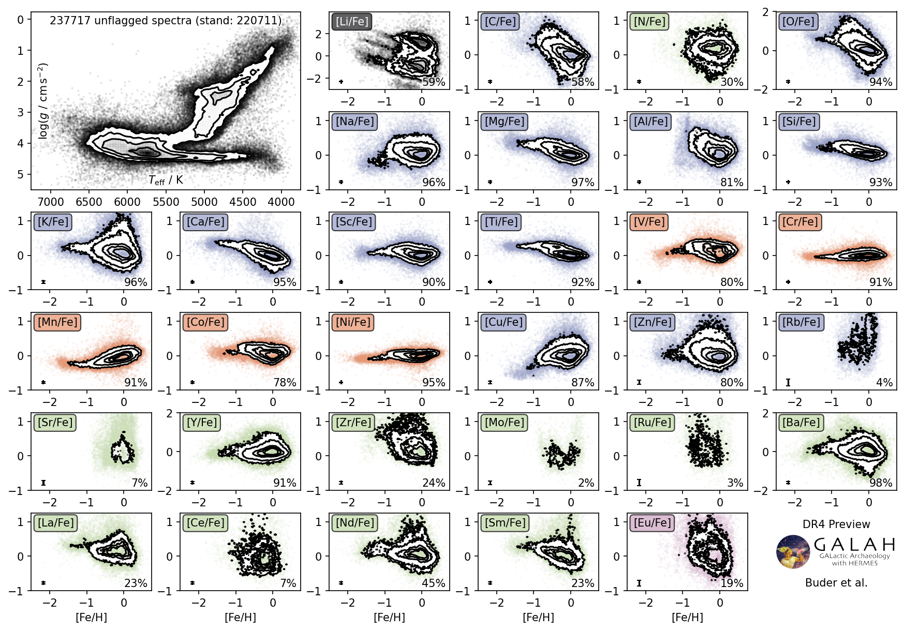
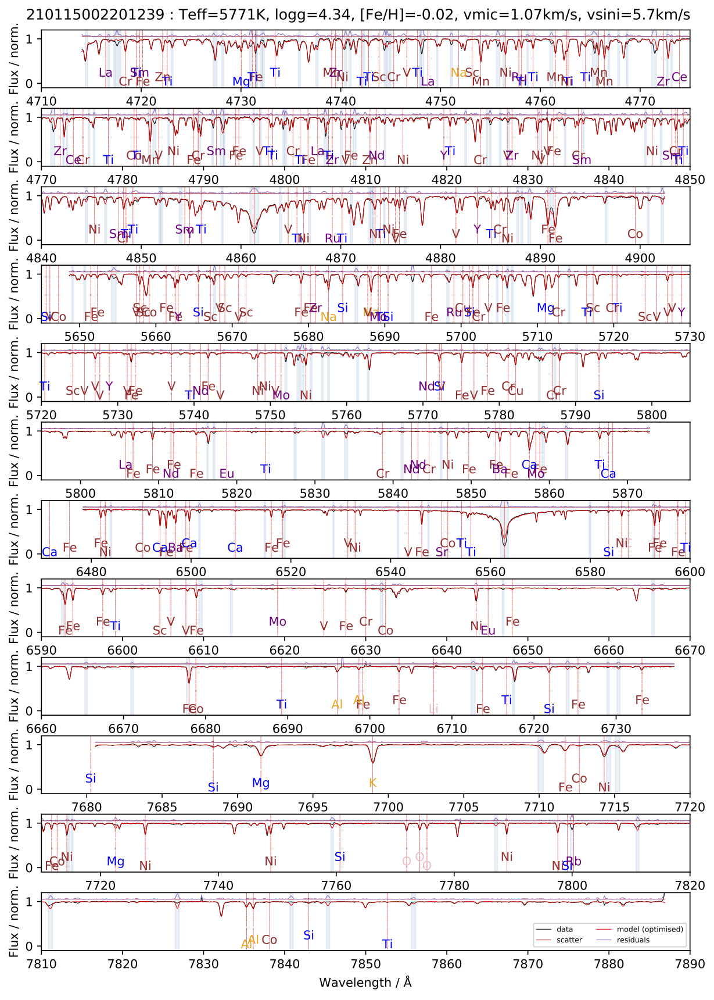
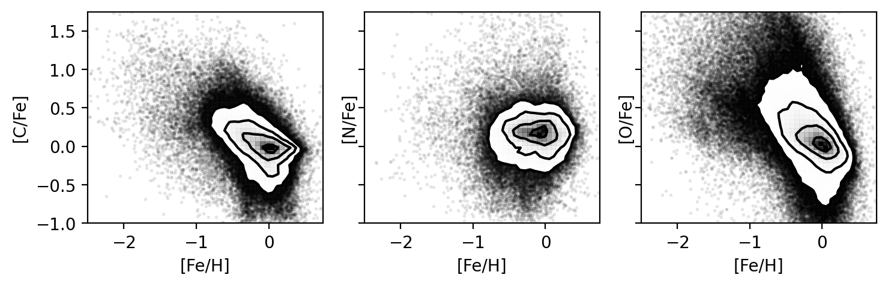
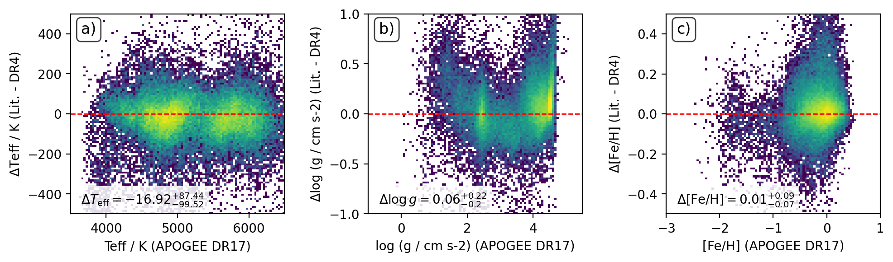
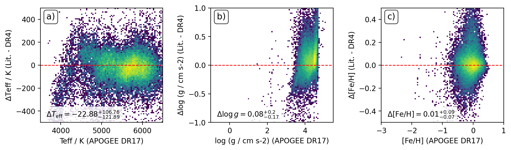
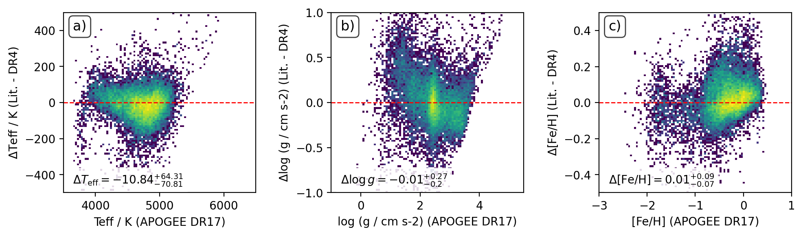
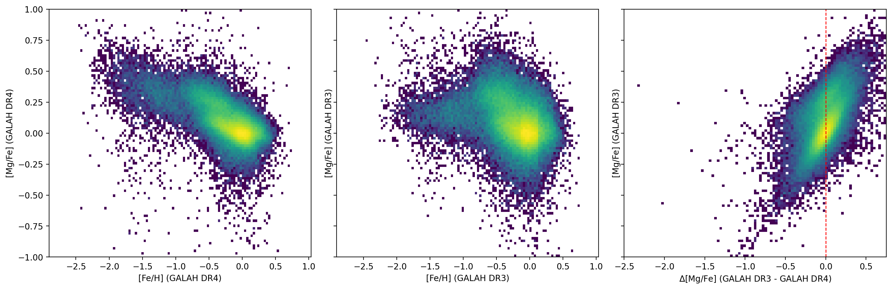
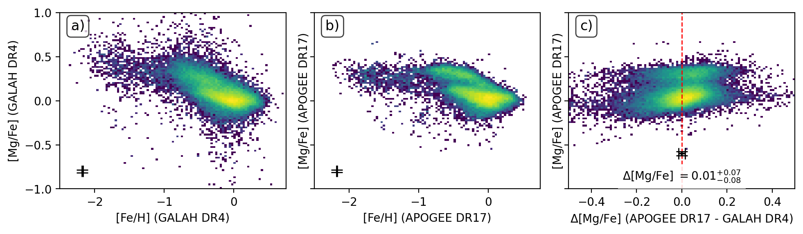
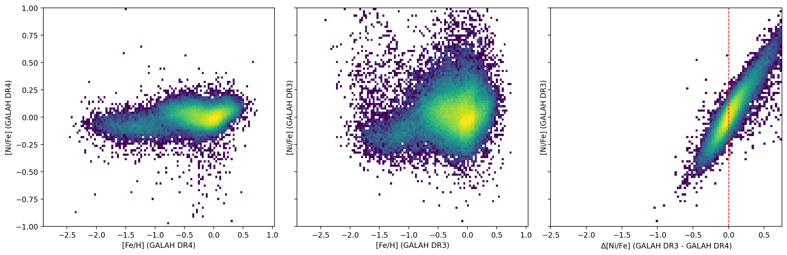
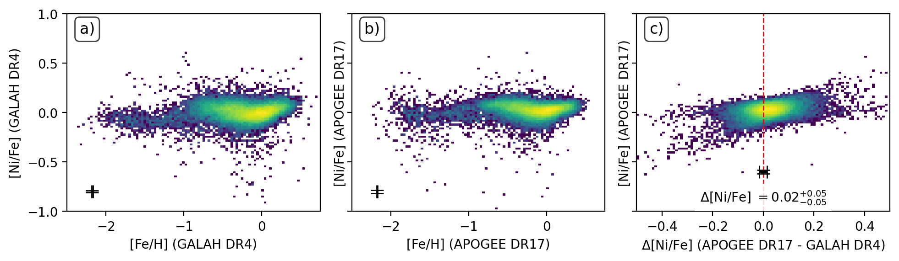

# GALAH_DR4

This repository accompanies the Data Release 4 (DR4) of the Galactic Archaeology with HERMES (GALAH) Survey.

## About Galactic Archaeology with HERMES (GALAH)

GALAH is a stellar spectroscopic survey of a million stars in the Milky Way. It's scientific motivation is described by [De Silva et al. (2015)](http://adsabs.harvard.edu/abs/2015MNRAS.449.2604D). GALAH had three previous data releases: DR1 [(Martell et al. 2017)](https://ui.adsabs.harvard.edu/abs/2017MNRAS.465.3203M), DR2 [Buder et al. 2018)](https://ui.adsabs.harvard.edu/abs/2018MNRAS.478.4513B), and DR3 [(Buder et al. 2021)](https://ui.adsabs.harvard.edu/abs/2021MNRAS.506..150B). For more information see [the GALAH survey website](https://www.galah-survey.org).

## Where to find and how to use the data release catalogs

The catalogs will be released publicly on the datacentral website: [http://datacentral.org.au/teamdata/GALAH/public/](http://datacentral.org.au/teamdata/GALAH/public/).

The inofficial releases can be downloaded by logging into the internal GALAH website: [https://internal.galah-survey.org](https://internal.galah-survey.org)

Use flag_sp == 0 and flag_x_fe == 0 for best results!

## Overview of this repository as a way to reproduce results and understand the analysis

In this repository, you find the relevant code and example spectra (excluding large files) for reproducing the GALAH data analysis. Input files are provided by the reduction pipeline of GALAH, which is also published on a [github repository](https://github.com/sheliak/galah_reduction).

GALAH operates with unique *sobject_id* as identifier of spectra for dates (first 6 digits), runs (next 4 digits), and repeats (next 2 digits), fibres (next 3 digits), and CCDs (last digit).

Code/Files are accessed in the following order:
1. observations (reduced spectra for each sobject_id in subdirectories of date/sobject_id from the reduction pipeline),
2. auxiliary_information (information to aid the spectroscopic analysis, e.g. cross matches with Gaia and other catalogs/literature),
3. spectrum_grids (code used to create the synthetic spectra with SME, including IDL scripts with SME580),
4. spectrum_interpolation (spectrum interpolation models/code used to train them with neural networks based on the synthetic spectra), 
5. spectrum_analysis (code used to analyse the reduced spectra),
6. analysis_products (directory where the analysis products are saved, including the synthetic spectra and renormalised observations),
7. spectrum_post_processing (directory where the post processing code and processed data products are stored),
8. validation (directory with validation codes and diagnostic figures), and
9. catalogs (final catalogs to be published).

## Overview of the data release products as of 13 July 2022

This is a trial of the analysis pipeline. While the pipeline is still under development, only a subset of stars has been run, which led to the analysis of 237,717 spectra without raising quality flags for the main parameters.

### What's new? Fastly interpolated synthetic spectra for the whole wavelength range

To allow the simultanious fitting of stellar parameters and abundances (a shortcoming of the previous data releases affecting especially blended regions), we have changed our fitting approach. We are now producing synthetic spectra for a limited random selection and train neural networks on them. This allows to fit all 5 stellar parameters (Teff, logg, [Fe/H], vmic, vsini) and up to 31 elemental abundances at the same time.

    

### What's new? CNO Abundances

We are fitting CNO abundances now! Thanks to the enhanced creation of synthetic stellar spectra, we are now also producing synthetic spectra for regions with strong molecular absorption features, like C2 (C12-C12 Swan bands before 4738Å) and CN (beyond 7870Å) as well as an underlying CN feature throughout most of the red and infrared region (most notably in cool giants).

    

## Validation

### Gaia FGK Benchmark Stars

    

### APOGEE DR17     

#### Comparison of APOGEE DR17 stellar parameters with GALAH DR4, for all stars (top), dwarfs (middle) and giants (bottom).

    
    
    

    
#### [Fe/H] vs. [Mg/Fe] compared to GALAH DR3 and APOGEE DR17
    

    
    

#### [Fe/H] vs. [Ni/Fe] compared to GALAH DR3 and APOGEE DR17

    
    

## Data model of galah_dr4_allspec file

*Column Name* | *Units* | *Description* | *Data Type* | 
:--------------|:--------------|:------------|:----------|
sobject_id |  | GALAH identifier | >i8 | 
tmass_id |  | 2MASS identifier | <U16 | 
gaiadr3_source_id |  | Gaia DR3 source_id | >i8 | 
ra | deg | propagated from Gaia DR3 | >f8 | 
dec | deg | propagated from Gaia DR3 | >f8 | 
flag_sp |  | Major spectroscopic fitting quality bitmask flag | >i8 | 
chi2_sp |  | Chi2 value of spectroscopic fitting | >f4 | 
model_name |  | Neural network model used for creating synthetic spectra | <U16 | 
teff | K | Spectroscopic effective temperature (used for fitting) | >f4 | 
e_teff | K | Uncertainty teff | >f4 | 
logg | log(cm.s**-2) | Spectroscopic surface gravity (used for fitting) | >f4 | 
e_logg | log(cm.s**-2) | Uncertainty logg | >f4 | 
fe_h | dex | Abundance of Fe and all other elements not fitted in GALAH (Fe: 1D-NLTE) | >f4 | 
e_fe_h | dex | Uncertainty fe_h | >f4 | 
flag_fe_h |  | Quality flag fe_h | >i8 | 
vmic | km s-1 | Microturbulence velocity (fitted) | >f4 | 
e_vmic | km s-1 | Uncertainty vmic | >f4 | 
vsini | km s-1 | Broadening velocity (fitted sme.vsini with sme.vmac=0) | >f4 | 
e_vsini | km s-1 | Uncertainty of vsini | >f4 | 
li_fe | dex | Elemental abundance for [Li/Fe] | >f4 | 
e_li_fe | dex | Uncertainty Li_fe | >f4 | 
flag_li_fe | dex | Quality bitmask flag of Li_fe | >i8 | 
c_fe | dex | Elemental abundance for [C/Fe] | >f4 | 
e_c_fe | dex | Uncertainty C_fe | >f4 | 
flag_c_fe | dex | Quality bitmask flag of C_fe | >i8 | 
n_fe | dex | Elemental abundance for [N/Fe] | >f4 | 
e_n_fe | dex | Uncertainty N_fe | >f4 | 
flag_n_fe | dex | Quality bitmask flag of N_fe | >i8 | 
o_fe | dex | Elemental abundance for [O/Fe] | >f4 | 
e_o_fe | dex | Uncertainty O_fe | >f4 | 
flag_o_fe | dex | Quality bitmask flag of O_fe | >i8 | 
na_fe | dex | Elemental abundance for [Na/Fe] | >f4 | 
e_na_fe | dex | Uncertainty Na_fe | >f4 | 
flag_na_fe | dex | Quality bitmask flag of Na_fe | >i8 | 
mg_fe | dex | Elemental abundance for [Mg/Fe] | >f4 | 
e_mg_fe | dex | Uncertainty Mg_fe | >f4 | 
flag_mg_fe | dex | Quality bitmask flag of Mg_fe | >i8 | 
al_fe | dex | Elemental abundance for [Al/Fe] | >f4 | 
e_al_fe | dex | Uncertainty Al_fe | >f4 | 
flag_al_fe | dex | Quality bitmask flag of Al_fe | >i8 | 
si_fe | dex | Elemental abundance for [Si/Fe] | >f4 | 
e_si_fe | dex | Uncertainty Si_fe | >f4 | 
flag_si_fe | dex | Quality bitmask flag of Si_fe | >i8 | 
k_fe | dex | Elemental abundance for [K/Fe] | >f4 | 
e_k_fe | dex | Uncertainty K_fe | >f4 | 
flag_k_fe | dex | Quality bitmask flag of K_fe | >i8 | 
ca_fe | dex | Elemental abundance for [Ca/Fe] | >f4 | 
e_ca_fe | dex | Uncertainty Ca_fe | >f4 | 
flag_ca_fe | dex | Quality bitmask flag of Ca_fe | >i8 | 
sc_fe | dex | Elemental abundance for [Sc/Fe] | >f4 | 
e_sc_fe | dex | Uncertainty Sc_fe | >f4 | 
flag_sc_fe | dex | Quality bitmask flag of Sc_fe | >i8 | 
ti_fe | dex | Elemental abundance for [Ti/Fe] | >f4 | 
e_ti_fe | dex | Uncertainty Ti_fe | >f4 | 
flag_ti_fe | dex | Quality bitmask flag of Ti_fe | >i8 | 
v_fe | dex | Elemental abundance for [V/Fe] | >f4 | 
e_v_fe | dex | Uncertainty V_fe | >f4 | 
flag_v_fe | dex | Quality bitmask flag of V_fe | >i8 | 
cr_fe | dex | Elemental abundance for [Cr/Fe] | >f4 | 
e_cr_fe | dex | Uncertainty Cr_fe | >f4 | 
flag_cr_fe | dex | Quality bitmask flag of Cr_fe | >i8 | 
mn_fe | dex | Elemental abundance for [Mn/Fe] | >f4 | 
e_mn_fe | dex | Uncertainty Mn_fe | >f4 | 
flag_mn_fe | dex | Quality bitmask flag of Mn_fe | >i8 | 
co_fe | dex | Elemental abundance for [Co/Fe] | >f4 | 
e_co_fe | dex | Uncertainty Co_fe | >f4 | 
flag_co_fe | dex | Quality bitmask flag of Co_fe | >i8 | 
ni_fe | dex | Elemental abundance for [Ni/Fe] | >f4 | 
e_ni_fe | dex | Uncertainty Ni_fe | >f4 | 
flag_ni_fe | dex | Quality bitmask flag of Ni_fe | >i8 | 
cu_fe | dex | Elemental abundance for [Cu/Fe] | >f4 | 
e_cu_fe | dex | Uncertainty Cu_fe | >f4 | 
flag_cu_fe | dex | Quality bitmask flag of Cu_fe | >i8 | 
zn_fe | dex | Elemental abundance for [Zn/Fe] | >f4 | 
e_zn_fe | dex | Uncertainty Zn_fe | >f4 | 
flag_zn_fe | dex | Quality bitmask flag of Zn_fe | >i8 | 
rb_fe | dex | Elemental abundance for [Rb/Fe] | >f4 | 
e_rb_fe | dex | Uncertainty Rb_fe | >f4 | 
flag_rb_fe | dex | Quality bitmask flag of Rb_fe | >i8 | 
sr_fe | dex | Elemental abundance for [Sr/Fe] | >f4 | 
e_sr_fe | dex | Uncertainty Sr_fe | >f4 | 
flag_sr_fe | dex | Quality bitmask flag of Sr_fe | >i8 | 
y_fe | dex | Elemental abundance for [Y/Fe] | >f4 | 
e_y_fe | dex | Uncertainty Y_fe | >f4 | 
flag_y_fe | dex | Quality bitmask flag of Y_fe | >i8 | 
zr_fe | dex | Elemental abundance for [Zr/Fe] | >f4 | 
e_zr_fe | dex | Uncertainty Zr_fe | >f4 | 
flag_zr_fe | dex | Quality bitmask flag of Zr_fe | >i8 | 
mo_fe | dex | Elemental abundance for [Mo/Fe] | >f4 | 
e_mo_fe | dex | Uncertainty Mo_fe | >f4 | 
flag_mo_fe | dex | Quality bitmask flag of Mo_fe | >i8 | 
ru_fe | dex | Elemental abundance for [Ru/Fe] | >f4 | 
e_ru_fe | dex | Uncertainty Ru_fe | >f4 | 
flag_ru_fe | dex | Quality bitmask flag of Ru_fe | >i8 | 
ba_fe | dex | Elemental abundance for [Ba/Fe] | >f4 | 
e_ba_fe | dex | Uncertainty Ba_fe | >f4 | 
flag_ba_fe | dex | Quality bitmask flag of Ba_fe | >i8 | 
la_fe | dex | Elemental abundance for [La/Fe] | >f4 | 
e_la_fe | dex | Uncertainty La_fe | >f4 | 
flag_la_fe | dex | Quality bitmask flag of La_fe | >i8 | 
ce_fe | dex | Elemental abundance for [Ce/Fe] | >f4 | 
e_ce_fe | dex | Uncertainty Ce_fe | >f4 | 
flag_ce_fe | dex | Quality bitmask flag of Ce_fe | >i8 | 
nd_fe | dex | Elemental abundance for [Nd/Fe] | >f4 | 
e_nd_fe | dex | Uncertainty Nd_fe | >f4 | 
flag_nd_fe | dex | Quality bitmask flag of Nd_fe | >i8 | 
sm_fe | dex | Elemental abundance for [Sm/Fe] | >f4 | 
e_sm_fe | dex | Uncertainty Sm_fe | >f4 | 
flag_sm_fe | dex | Quality bitmask flag of Sm_fe | >i8 | 
eu_fe | dex | Elemental abundance for [Eu/Fe] | >f4 | 
e_eu_fe | dex | Uncertainty Eu_fe | >f4 | 
flag_eu_fe | dex | Quality bitmask flag of Eu_fe | >i8 | 
v_bary_eff | km s-1 | Barycentric velocity applied to reduced spectra | >f8 | 
red_rv_ccd | km s-1 | Reduction pipeline best radial velocity for each CCD | >f4 | 
red_e_rv_ccd | km s-1 | Reduction pipeline uncertainty of red_rv_ccd | >f4 | 
red_rv_com | km s-1 | Reduction pipeline combined best radial velocity | >f8 | 
red_e_rv_com | km s-1 | Reduction pipeline uncertainty of red_rv_com | >f8 | 
red_teff | K | Reduction pipeline best teff | >f8 | 
red_logg | log(cm.s**-2) | Reduction pipeline best logg | >f8 | 
red_fe_h | dex | Reduction pipeline best fe_h | >f8 | 
red_alpha_fe | dex | Reduction pipeline best alpha_fe | >f8 | 
red_vmic | km s-1 | Reduction pipeline best vmic | >f8 | 
red_vbroad | km s-1 | Reduction pipeline best vbroad | >f8 | 
red_flag |  | Reduction pipeline quality bitmask flag | >i8 | 
sb2_rv_16 | km s-1 | 16th perc. radial velocity of fit to syn-obs residuals | >f4 | 
sb2_rv_50 | km s-1 | 50th perc. radial velocity of fit to syn-obs residuals | >f4 | 
sb2_rv_84 | km s-1 | 84th perc. radial velocity of fit to syn-obs residuals | >f4 | 
ew_h_beta | Angstroem | Equivalent Width of fit for syn-obs residuals at Hbeta core | >f4 | 
ew_h_alpha | Angstroem | Equivalent Width of fit for syn-obs residuals at Halpha core | >f4 | 
ew_k_is | Angstroem | Equivalent Width of fit for K7699 Interstellar Line | >f4 | 
sigma_k_is |  | Sigma auf Gaussian fit for K7699 Interstellar Line | >f4 | 
rv_k_is | km s-1 | Radial velocity of fit to syn-obs residuals around K7699 line | >f4 | 
ew_dib5780 | Angstroem | Equivalent Width of fit for 5780 Diffiuse Interstellar Band | >f4 | 
sigma_dib5780 |  | Sigma auf Gaussian fit for 5780 DIB | >f4 | 
rv_dib5780 | km s-1 | Radial velocity of fit to syn-obs residuals around 5780 DIB | >f4 | 
ew_dib5797 | Angstroem | Equivalent Width of fit for 5797 Diffiuse Interstellar Band | >f4 | 
sigma_dib5797 |  | Sigma auf Gaussian fit for 5797 DIB | >f4 | 
rv_dib5797 | km s-1 | Radial velocity of fit to syn-obs residuals around 5797 DIB | >f4 | 
ew_dib6613 | Angstroem | Equivalent Width of fit for 6613 Diffiuse Interstellar Band | >f4 | 
sigma_dib6613 |  | Sigma auf Gaussian fit for 6613 DIB | >f4 | 
rv_dib6613 | km s-1 | Radial velocity of fit to syn-obs residuals around 6613 DIB | >f4 | 
snr |  | Average signal-to-noise ratio (per pixel) of each CCD | >f4 | 

## Authors
- [Sven Buder](https://github.com/svenbuder) (ANU, ASTRO 3D)

## Attribution
If you make use of this code, please cite the paper::

    @article{Buder2022,
      url = {https://github.com/svenbuder/GALAH_DR4},
      year = in prep.,
      author = {Sven Buder},
      title = {The GALAH Survey: Data Release 4}
    }
